# WRITEUP - Capture The Flag JNIC 2023

Equipo JitaNICos (3/72)

- Isaac Lozano Osorio (isaac.lozano@urjc.es)
- Raúl Martín Santamaría (raul.martin@urjc.es)
- Sergio Pérez Peló (sergio.perez.pelo@urjc.es)

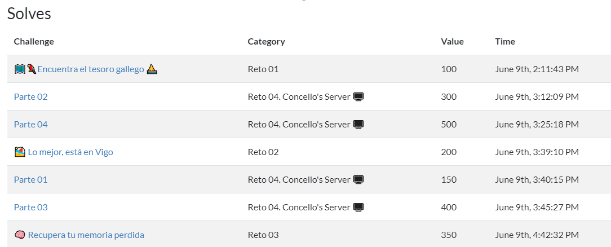


Enlace CTF: https://ctf.unex.es/ <br>
Enlace JNIC: https://2023.jnic.es/ctf/

## Reto 01: 🗺🗺🦜🦜Encuentra el tesoro gallego ⛵⛵


En este reto nos encontramos con una web que contiene varios elementos:


```
1. Un script que valida la entrada del usuario, teniendo que cumplirse ciertas condiciones para que se dé por válida.
2. Una sección oculta con cadenas que parecen ser hashses.
```
Analizando el script, vemos que comprueba y da como válida la entrada del usuario si se cumplen ciertas restricciones. Antes de lanzarnos a analizar paso a paso cada línea del script, en vista de la sección oculta, decidimos probar todos los valores de la misma mediante un código Javascript sencillo:

```
var resultados = ["27254b01679382da04bd582aaf950bc895cd7397508c960144","2bc4fa0edb8f594c6b49b
```
```
for(var i=0; i<resultados.length;i++){
if(validate(resultados[i]))
console.log(resultados[i]);
}
```
La ejecución de este pequeño código nos devuelve un único resultado válido:

```
5a6d78685a33744a624777306331394461544e7a66516f3d0a
```
En este caso, se utiliza la herramienta Hash Type Identifier, incluida en la web https://hashes.com/. El resultado obtenido nos indica que, posiblemente, la cadena esté codificada en hexadecimal, devolviéndonos el resultado de la decodificación.

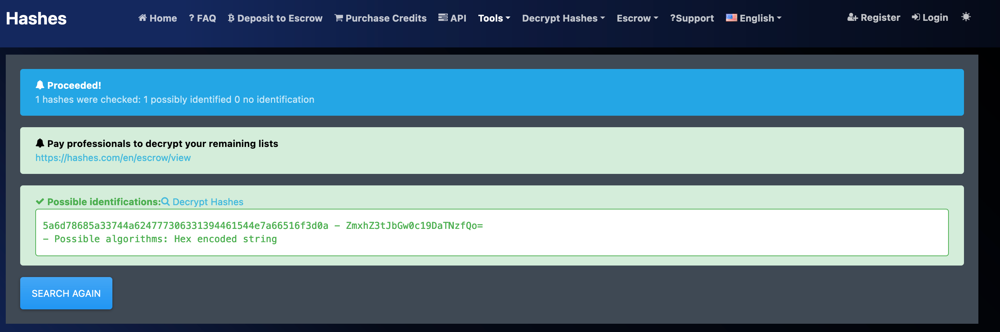

Llevándonos la cadena a la herramienta Cyberchef (https://gchq.github.io/CyberChef/), podemos comprobar que el resultado es correcto, realizando la decodificación final y obteniendo la flag.

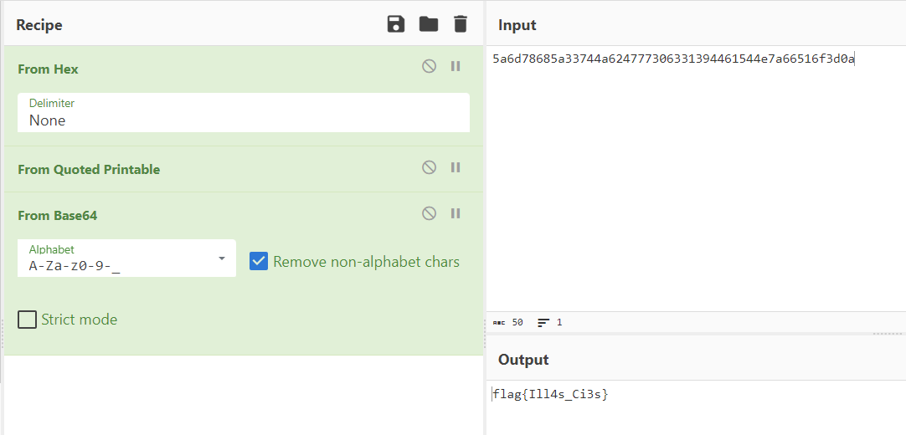


Flag: flag{Ill4s_Ci3s}

## Reto 02: 🏖🏖 Lo mejor, está en Vigo


En este reto nos encontramos con dos archivos: una imágen y un vídeo. Procedemos a analizar ambos elementos.

Al visualizar el vídeo se aprecia un ruido antinatural en el audio, por lo que se extrae el audio del vídeo y se realiza un análisis de espectograma. Para ello se pueden usar herramientas como Audacity o Sonic-visualiser. En este caso, para realizar una prueba rápida se utilizó https://academo.org/demos/spectrum-analyzer/, donde seleccionando la opción Logarithmic Frequency Scale se aprecia lo siguiente:

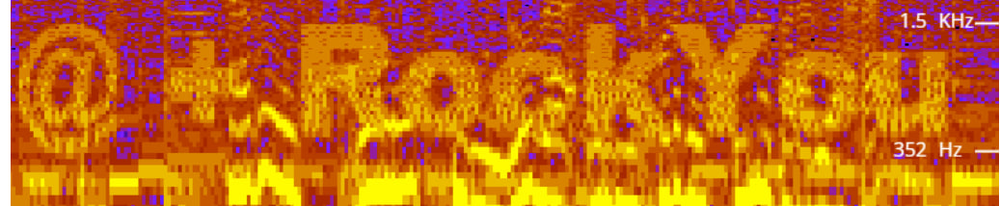

Esto nos lleva a pensar que la imagen adjunta tiene algún tipo de información oculta mediante técnicas de esteganografía, y que esta información está protegida por contraseña. Por lo mostrado en el espectrograma, se puede deducir que esta contraseña se encuentra en el diccionario RockYou, pero debe añadirse el caracter @ delante de la clave para que sea correcta.
Para extraer el contenido oculto en la imagen, lo primero que se hace es modificar el contenido del diccionario RockYou, añadiendo el caracter @ delante de cada palabra que contiene, creando un nuevo diccionario nombrado como rockyouarr.txt.


Utilizando este nuevo diccionario junto con la herramienta Stegseek (https://github.com/RickdeJager/stegseek). Obtenemos la información oculta con la password @nicole. En este caso, la información oculta consiste en una nueva imagen:

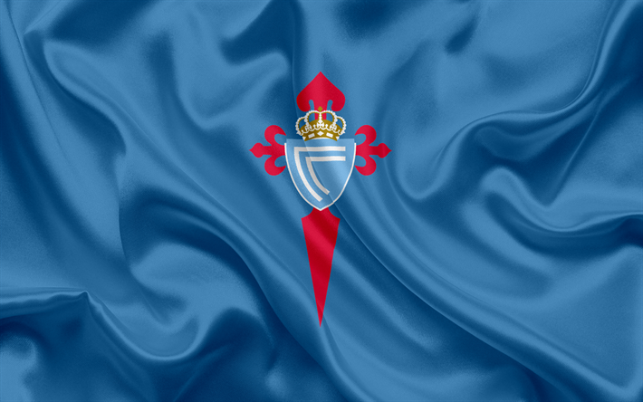

Analizando la imagen con la suit de herramientas para esteganografía de Dominic Breuker (https://github.com/DominicBreuker/stego-toolkit), podemos observar que la flag ha sido encontrada por las herramientas strings y zsteg:

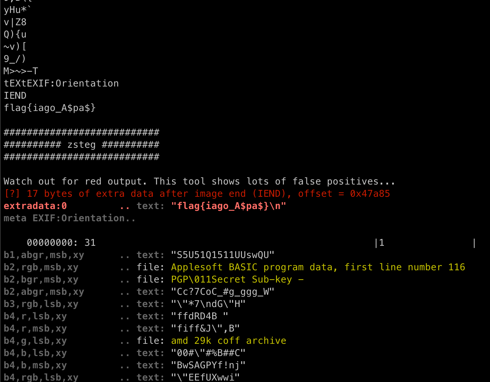


Flag: flag{iago_A$pa$}

## Reto 03: 🧠🧠 Recupera tu memoria perdida


Para analizar la imagen de memoria proporcionada, se ha utilizado Autopsy (https://www.autopsy.com/). Con esta herramienta se observó el timeline de la imagen para intentar encontrar algo interesante en los archivos modificados recientemente, sin éxito.
Dado que el nombre del reto es Recupera tu memoria perdida, lo siguiente que se hizo fue mirar archivos eliminados, donde se encontraron fragmentos de memoria que parecían seguir una secuencia (concretamente, xf y xk estaban en ficheros eliminados, mientras que xa, xb, xc, xd, xe, xg, xh, xi y xj se encontraban presentes como ficheros sin eliminar dentro de la imagen). Se pasó entonces a unificar esas partes, obteniendo una imagen de memoria nueva. Al cargarla en Autopsy, no se observaron grandes diferencias en cuanto a la imagen original, por lo que continuamos trabajando sobre ella. En este punto, decidimos buscar el substring JNIC en Autopsy, lo que nos reportó los siguientes resultados:

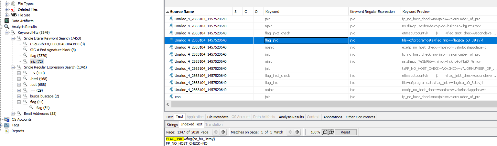


Obteniendo de esta forma la flag del reto.

Flag: flag{ca_b0_3stay}

## Reto 04: Concello’s Server 🖥🖥


### Parte 1 - ¿Sabrias quién es el usuario que administra la plataforma?

Para resolver este reto, comenzamos montando la OVA proporcionada en VirtualBox siguiendo las instrucciones del PDF adjunto en la plataforma. Utilizamos nmap para descubrir todos los hosts que existan en la subred, y escaneamos sus puertos, obteniendo el siguiente resultado:

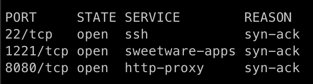

Descubrimos los puertos 22, 1221 y 8080 abiertos de TCP para la IP 192.168.1.205.
Accedemos a la web utilizando Firefox, y vemos un blog de Wordpress.

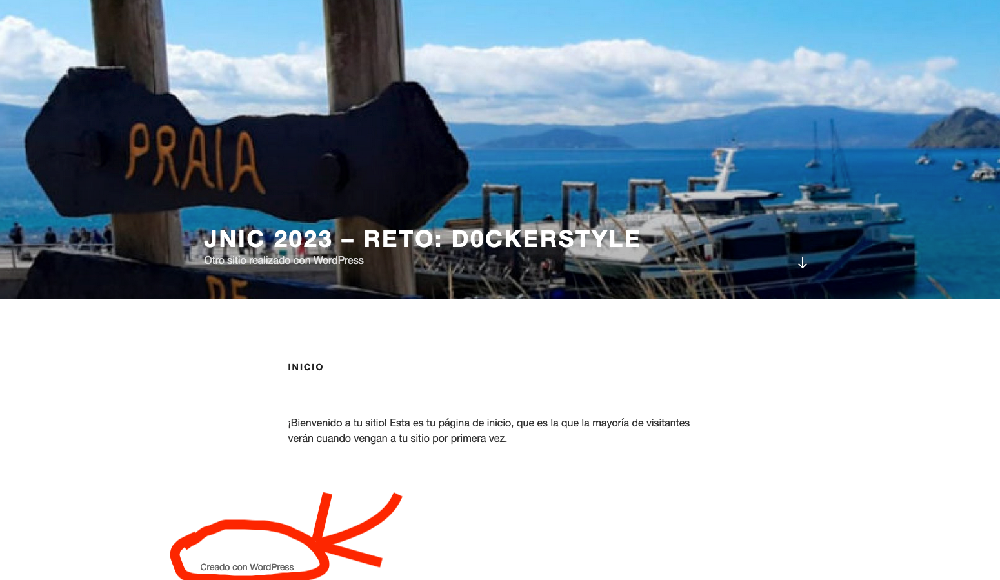


Utilizando wpscan, enumeramos usuarios, y descubrimos el usuario r0D4s con el siguiente comando:

```
wpscan -e u --url http://192.168.1.205:8080/
```

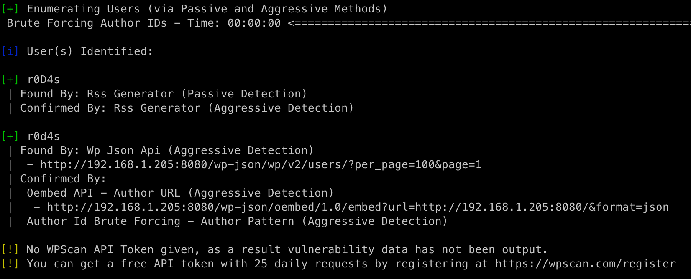


Flag: flag{r0D4s}

### Parte 2

Enumeramos utilizando dirsearch de la siguiente forma:

```
dirsearch -u http://192.168.1.205:8080/ -t 50
```

Entre los resultados interesantes, vemos el directorio lostpassword.

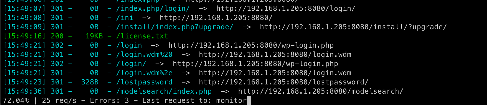

Repetimos comando añadiendo /lostpassword/ a la URL y obtenemos password.txt.
En base esto, continuamos resolviendo el resto del reto, y posteriormente volvemos a este punto y descubrimos la flag que nos faltaba, probando a enumerar utilizando rockyou + .txt

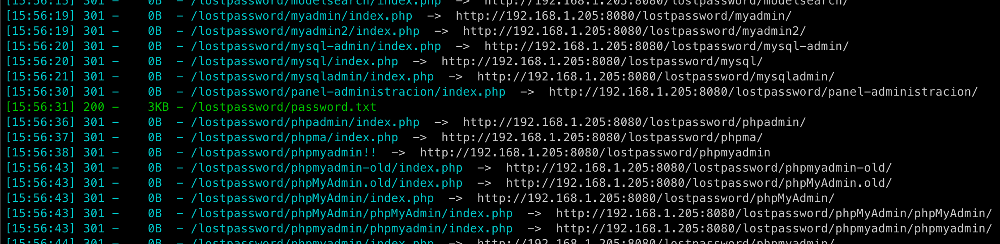

Flag: flag{O_V4o}

### Parte 3

El fichero password.txt contiene una clave privada codificada en base64. Gracias a nmap, sabemos que hay un servicio SSH escuchando en el puerto 1221. Nos logeamos en dicho host utilizando la clave privada que hemos encontrado, tras haberle asignado a la clave los permisos pertinentes ( chmod 400 ), y en el MOTD vemos la tercera flag, que intentamos meter como segunda flag y no funcionaba. Tras esto volvimos a por la
segunda flag.

```
cat password.txt | base64 -d >passwordDecoded.txt
chmod 400 passwordDecoded.txt
ssh -p 1221 r0D4s@192.168.1.205 -i passwordDecoded.txt
```

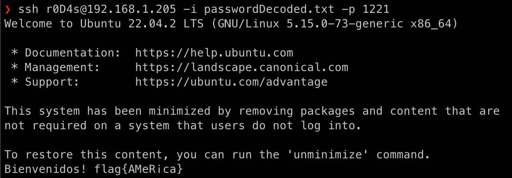

Flag: flag{AMeR¡ca}

### Parte 4

En los ficheros del directorio home del usuario, vemos un Dockerfile que explica cómo se ha dividido la flag. Observando los diferentes comandos ejecutados, vemos que la primera parte de la flag esta en /etc/1.png, pero el fichero no existe. Extrayendo todas las capas del contenedor, de las diferentes carpetas con nombre en hexadecimal, obtenemos primero la primera parte de la flag, y luego la segunda.

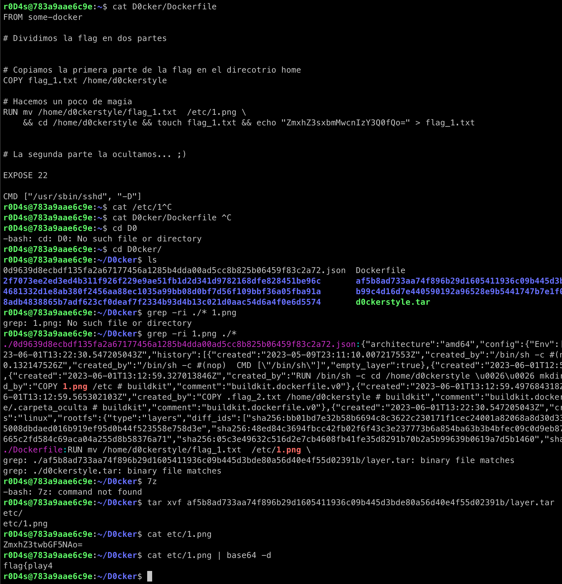

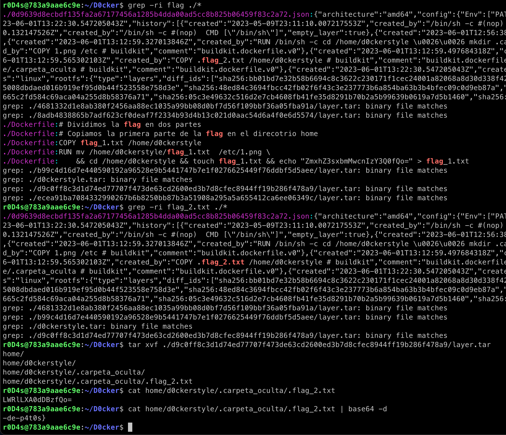


Flag: flag{play4-de-p4t0s}


## Clasificación final

| **Place** |          **Team**         | **Score** |
|:---------:|:-------------------------:|:---------:|
|     1     | AIR Security              | 2000      |
|     2     | Pirates of the Cantabrian | 2000      |
|     3     | **JitaNICos**             | 2000      |
|     4     | signos de puntuación      | 2000      |
|     5     | Solid Zero Points         | 2000      |
|     6     | MUexperts                 | 2000      |
|     7     | Qrpmoldbkfqlobp23         | 2000      |
|     8     | cuak                      | 2000      |
|     9     | CyberShots                | 2000      |
|     10    | Lucius                    | 2000      |
|     11    | FlagFreaks                | 2000      |
|     12    | Debauchery Tea Party      | 2000      |
|     13    | Chuchichäschtli           | 2000      |
|     14    | Not0                      | 2000      |
|     15    | CyberSleuths              | 2000      |
|     16    | ICAI Cyber Team           | 2000      |
|     17    | milanesaconqueso          | 2000      |
|     18    | loyaltym                  | 2000      |
|     19    | Deckcard23                | 1850      |
|     20    | Er clu penguin            | 1650      |
|     21    | CloudNine                 | 1600      |
|     22    | leonuz                    | 1350      |
|     23    | 4fun                      | 1300      |
|     24    | blueteam                  | 1300      |
|     25    | Frijolitos                | 1250      |
|     26    | CazonesVivos              | 1150      |
|     27    | IcebergAtomico            | 1100      |
|     28    | 🤠                        | 1100      |
|     29    | perfectmegateam           | 1050      |
|     30    | Jail is for noobies       | 1050      |
|     31    | flagHunters               | 950       |
|     32    | GoofyTeamName             | 900       |
|     33    | Daysa && Mike && Charli   | 800       |
|     34    | Who_CARES                 | 700       |
|     35    | Hehe                      | 650       |
|     36    | determined_ellis          | 650       |
|     37    | Asterixco                 | 650       |
|     38    | Hackiit                   | 600       |
|     39    | CyberDrivers_             | 600       |
|     40    | Cybwarriors               | 600       |
|     41    | Krom's Empire             | 600       |
|     42    | BlackFlies                | 450       |
|     43    | z3m0g                     | 450       |
|     44    | B14ck                     | 450       |
|     45    | Manueldj                  | 400       |
|     46    | Stallman                  | 400       |
|     47    | RJ01                      | 300       |
|     48    | H4ck3rT34m                | 300       |
|     49    | werlibini                 | 300       |
|     50    | SoseHack                  | 300       |
|     51    | aea                       | 300       |
|     52    | Chones                    | 300       |
|     53    | sc0butanero               | 300       |
|     54    | bobr                      | 200       |
|     55    | Ratatronic                | 200       |
|     56    | ItsMeMario                | 200       |
|     57    | ServiciosPublicos         | 150       |
|     58    | wiwafiv851                | 150       |
|     59    | McAndChips                | 150       |
|     60    | EnVigoYEnDirecto          | 150       |
|     61    | Probando                  | 100       |
|     62    | _                         | 100       |
|     63    | Percu                     | 100       |
|     64    | Ingenieros Ingeniosos     | 100       |
|     65    | tuvigo                    | 100       |
|     66    | RITS                      | 100       |
|     67    | GRD Hackers               | 100       |
|     68    | InfosecEC                 | 100       |
|     69    | vcl                       | 100       |
|     70    | Bagelboyz                 | 100       |
|     71    | alicel                    | 100       |
|     72    | b33su4l                   | 100       |


